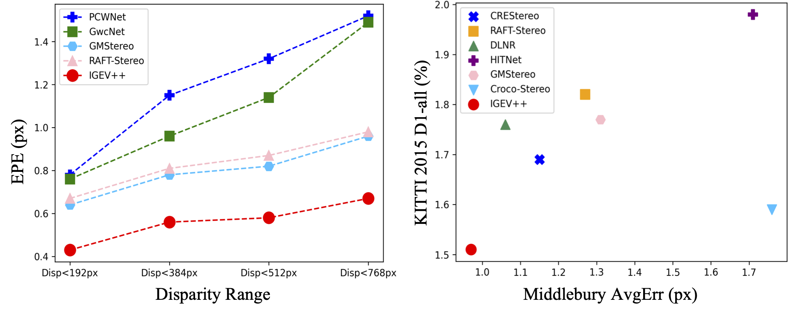

# IGEV++: Iterative Multi-range Geometry Encoding Volumes for Stereo Matching
Gangwei Xu, Xianqi Wang, Zhaoxing Zhang, Junda Cheng, Chunyuan Liao, Xin Yang <br>

## Network architecture

The IGEV++ first builds Multi-range Geometry Encoding Volumes (MGEV) via Adaptive Patch Matching (APM). MEGV encodes coarse-grained geometry information of the scene for textureless regions and large disparities and fine-grained geometry information for details and small disparities after 3D aggregation or regularization. Then we regress an initial disparity map from MGEV through $soft \; argmin$, which serves as the starting point for ConvGRUs. In each iteration, we index multi-range and multi-granularity geometry features from MGEV, selectively fuse them, and then input them into ConvGRUs to update the disparity field.

## Comparisons with SOTA methods

\textbf{Left:} Comparisons with state-of-the-art stereo methods across different disparity ranges on the Scene Flow test set. Our IGEV++ outperforms previously published methods by a large margin across all disparity ranges. 
Right: Comparisons with state-of-the-art stereo methods on Middlebury and KITTI leaderboards.


## Visual comparisons with SOTA methods in large disparities.

PCWNet is a volume filtering-based method, DLNR is an iterative optimization-based method, and GMStereo is a transformer-based method. They all struggle to handle large disparities in large textureless objects at a close range.

## Demos
Pretrained models can be downloaded from [google drive](https://drive.google.com/drive/folders/1eubNsu03MlhUfTtrbtN7bfAsl39s2ywJ?usp=drive_link)

We assume the downloaded pretrained weights are located under the pretrained_models directory.

You can demo a trained model on pairs of images. To predict stereo for demo-imgs directory, run
```Shell
python demo_imgs.py --restore_ckpt ./pretrained_models/igev_plusplus/sceneflow.pth
```

## Environment
* NVIDIA RTX 3090
* python 3.8
* torch 1.12.1+cu113

### Create a virtual environment and activate it.

```Shell
conda create -n IGEV_plusplus python=3.8
conda activate IGEV_plusplus
```
### Dependencies

```Shell
pip install torch==1.12.1+cu113 torchvision==0.13.1+cu113 torchaudio==0.12.1 --extra-index-url https://download.pytorch.org/whl/cu113
pip install tqdm
pip install scipy
pip install opencv-python
pip install scikit-image
pip install tensorboard
pip install matplotlib 
pip install timm==0.5.4

```

## Evaluation

To evaluate IGEV++ on Scene Flow or Middlebury, run

```Shell
python evaluate_stereo.py --restore_ckpt ./pretrained_models/igev_plusplus/sceneflow.pth --dataset sceneflow
```
or
```Shell
python evaluate_stereo.py --restore_ckpt ./pretrained_models/sceneflow/sceneflow.pth --dataset middlebury_H
```

To evaluate RT-IGEV++ (real-time version) on Scene Flow, run

```Shell
python evaluate_stereo_rt.py --restore_ckpt ./pretrained_models/igev_plusplus/sceneflow.pth --dataset sceneflow
```

## Training

To train IGEV++ on Scene Flow or KITTI, run

```Shell
python train_stereo.py --train_datasets sceneflow
```
or
```Shell
python train_stereo.py --restore_ckpt ./pretrained_models/igev_plusplus/sceneflow.pth --train_datasets kitti
```

## Submission

For IGEV++ submission to the KITTI benchmark, run
```Shell
python save_disp.py
```

For RT-IGEV++ submission to the KITTI benchmark, run
```Shell
python save_disp_rt.py
```
